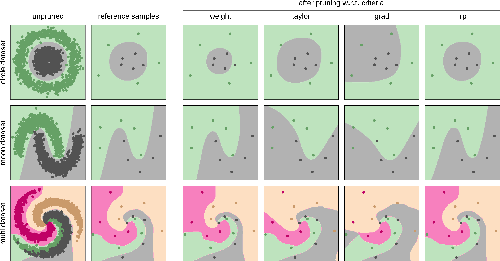
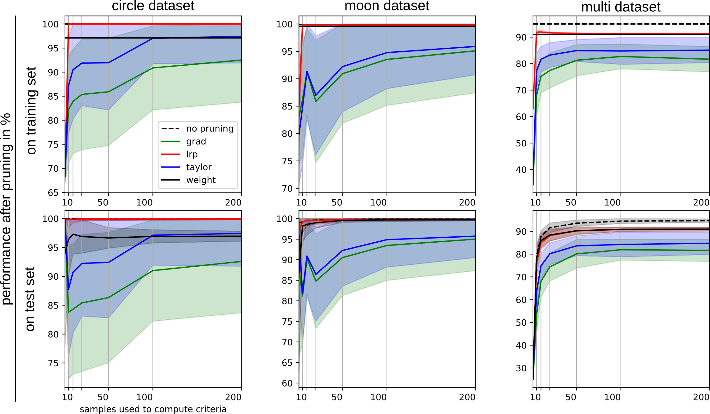

# An example for Neural Network Pruning with LRP and other measures, based on 2D toy datasets.
[>> Link to Preprint  <<](https://arxiv.org/abs/1912.08881)


**Qualitative comparison of the impact of the pruning criteria on the models’ decision function on three toy datasets.**
*1st column:* scatter plot of the training data and decision boundary of the trained model,
*2nd column:* data samples randomly selected for computing the pruning criteria,
*3rd to 6th columns:* changed decision boundaries after the application of pruning w.r.t. different criteria.



**Pruning performance comparison of criteria depending on the number of reference samples per class used for criterion computation.**
*1st row:* Model evaluation on the training data.
*2nd row:* Model evaluation on unseen samples, which have also been used for the computation of pruning criteria.
*Columns:* Results over different datasets. Solid lines show the average post-pruning performance of the models pruned w.r.t. to the evaluated criteria “weight” (black), “taylor” (blue), “grad(ient)” (green) and “lrp” (red) over 50 repetitions ofthe experiment. The dashed black line indicates the model’s evaluation performance without pruning. Shaded areas around the lines show the standard deviation over the repetition of experiments.


## How to use

First, familiarize yourself with the command line options.
```
$ python main.py --help

usage: main.py [-h] [--dataset DATASET] [--criterion CRITERION] [--numsamples NUMSAMPLES] [--seed SEED] [--rendermode RENDERMODE]
               [--colormap COLORMAP] [--logfile LOGFILE] [--generate] [--analyze] [--ranklog]

Neural Network Pruning Toy experiment

optional arguments:
  -h, --help            show this help message and exit
  --dataset DATASET, -d DATASET
                        The toy dataset to use. Choices: moon, circle, mult
  --criterion CRITERION, -c CRITERION
                        The criterion to use for pruning. Choices: lrp, taylor, grad, weight
  --numsamples NUMSAMPLES, -n NUMSAMPLES
                        Number of training samples to use for computing the pruning criterion.
  --seed SEED, -s SEED  Random seed used for (random) sample selection for pruning criterion computation.
  --rendermode RENDERMODE, -r RENDERMODE
                        Is result visualization desired? Choices: none, svg, show
  --colormap COLORMAP, -cm COLORMAP
                        The colormap to use for rendering the output figures. Must be a valid one from matplotlib.
  --logfile LOGFILE, -l LOGFILE
                        Output log file location. Results will pe appended. File location (folder) must exist!!!
  --generate, -g        Calls a function to generate a bunch of parameterized function calls. Recommendation: First call this tool with "-g",
                        then execute the generated scripts. If --generate is passed, the script will only generate the scripts and then
                        terminate.
  --analyze, -a         Calls a function to analyze the previously generated log file. If --analyze is passed (but not --generate) the script
                        will analyze the log specified via --logdir and draw some figures.
  --ranklog, -rl        Triggers a generation of scripts (when using -g) and an evaluation output, and analysis (when using -a) for neuron
                        ranking corellations.
```

Now, in order to (re)create our results, you can either (re)generate the our toy experiment scripts using the `--generate` (`-g`) switch.
This will then generate shell scripts to replicate the full pruning experiment. You will find these scripts are pre-generated in `scripts`.
Optionally consider adding the `--ranklog` (`-rl`) switch to generate shell scripts to only analyze the neuron selection for prunining per criterion (without performing the full prunig procedure, but spamming the log with megabytes worth of pruning order information instead), reference sample size and random seed for each toy dataset. The pre-generated scripts for the latter scenario can be found in `scripts-rankanalysis`.
```
$ python main.py -g [-rl]
```

Thereafter, you can execute the experiments by running the generated shell scripts, e.g.
```
for s in $script_dir/*.sh ;
do
    bash $s & # consider removing the "&" if your machine is lacking the RAM and CPU cores for parallel execution
done
```

Outputs will be written into a plain text log file specified via the `--logfile` (`-l`) during script generation
pre-computed result logs containing the results from our paper can be found.
Logs pre-computed for full pruning runs over 50 random seeds, as well as neuron rank analysis logs, can be found in `./output/log.txt` and `output-rankanalysis./log.txt respectively.`

A shell script as well as a resulting log file and csv figure files for generating the qualitative toy figure [toy-figure-mk2-test.png](toy-figure-mk2-test.png) above can be found in folder `output-toy-figure-mk2`.

The log files for comparing model performances (resulting i.e. in the pruning performance figure [](output/combined-processed.png) above) can be analyzed by adding the switch `--analyze` (`-a`), which overrides any other instructions (except for `-g`, which overrides the behavior of `-a`). An optional addition of the `--rl` switch directs the analysis towards neuron selection during pruning, instead of performance a comparison. An analysis can be instigated e.g. via specification of the log file containing the various statistics
```
$ python -a -rl -l output-rankanalysis/log.txt
```

Corresponding analysis outputs (i.e. large amounts of tables in plain text files when using the `-rl` switch, or line plots in svg file format when analyzing pre and post-pruning model performance) will be created next to the log file selected for analysis, and can already be found precomputedly in the `output*` folders of this repository.


